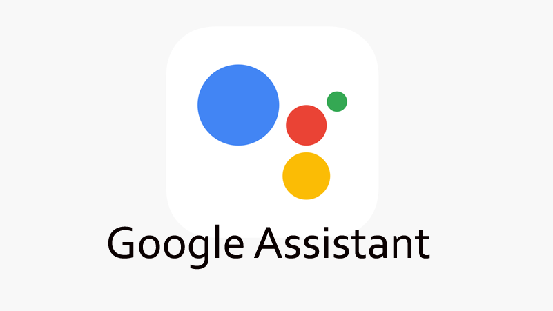
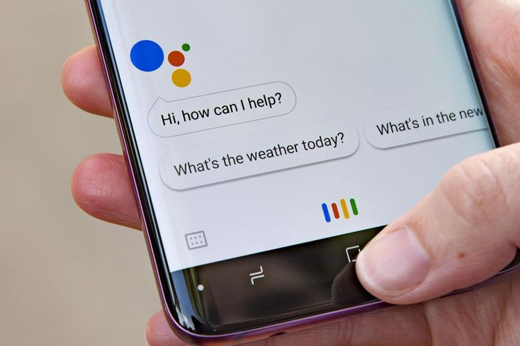

Roni Fiqri Suryanata  
Universitas Mulawarman  
Jurusan Informatika 2018  

# Google Assistant

Disini saya akan membahas mengenai salah satu teknologi dari Google yaitu Google Assistant.Teknologi ini adalah teknologi yang ada pada perangkat-perangkat yang menggunakan sistem operasi berbasis Android.  
  
Google Assistant adalah sebuah AI(_Artificial Inteligence_) atau kecerdasan buatan yang berperang sebagai asisten virtual yang dibuat oleh Google. Google Assistant dirilis secara umum oleh Google sejak Mei 2016 untuk aplikasi Google Allo. Pada tahun 2017, Google Assistant dikembangkan agar bisa mendukung di banyak jenis perangkat seperti mobil dan perangkat _smart home_. Perangkat-perangkat yang telah mendukun Google Assistant saat ini adalah seperti Android Wear, iPhone & iPad melalui aplikasi Google Assistant, perangkat smarthome, dan beberapa perangkat lainnya.
  

  
Cara penggunaan Google Assistant pada perangkat smartphone sangatlah sederhana :
1. Tekan dan tahan tombol home pada _smartphone_
2. Ketika ada sebuah _popup_ muncul, user bisa menyebutkan kata kunci perintah yang ingin dilakukan
3. Google akan mengeksekusi perintah tersebut dan memberikan _feedback_ kepada _user_

*Kelebihan* :
* Google Assistant mempermudah _user_ untuk melakukan sebuah aktifitas pada perangkat dengan lebih cepat memanfaatkan perintah suara
* Untuk teknologi Google Assistant yang sekarang fungsinya tidak terbatas hanya untuk melakukan pencarian, tetapi juga bisa melakukan hal lain seperti membuka suatu aplikasi, menyalakan dan mematikan perangkat pada perangkat smarthome, dll. 
  
*Kekurangan* :
* Harus membutuhkan koneksi internet yang stabil
* Belum mendukung semua bahasa
* Memakan daya perangkat
* Membutuhkan banyak penyimpanan dikarenakan membutuhkan versi Google terbaru untuk mendapatkan hasil yang maksimal
  
  
Jadi, Google Assistant adalah sebuah kecerdasan buatan yang bertugas sebagai asisten untuk membantu aktifitas user pada perangkat tersebut. Google Assistant menggunakan perintah suara dalam menerima perintah untuk di eksekusi. Teknologi ini bertujuan untuk mempersingkat dan mempermudah user dalam mengoperasikan perangkat sehingga user tidak perlu melakukan langkah-langkah yang panjang untuk melakukan suatu aktifitas. Google Assistant saat ini bersaing dengan teknologi asisten kecerdasan buatan juga yang dimiliki oleh Apple yaitu Siri.
